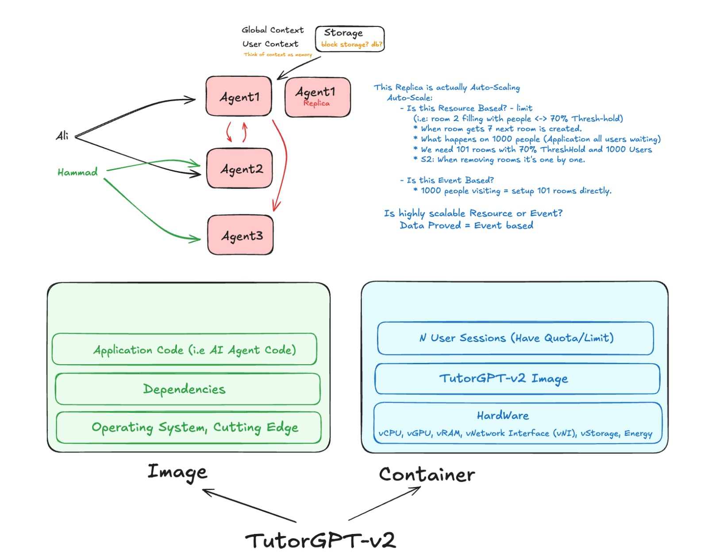

### 1. Resource Based Scaling:
Yeh scaling resources (jaise CPU, memory, ya storage) ke actual usage par based hoti hai. Hum pehle se ek limit ya threshold set kar dete hain, aur system khud monitor karta rehta hai. Jaise hi resources ka load us limit tak pahunchta hai, scaling automatically shuru ho jaati hai.

- **Clear Explanation in Tumhare Words**: "Resource base scaling means ke hum scaling ke liye ik limit set kardete hai ke agar resources itne percent consume ho rahe ho toh new instance bna ke scale karna. Jaise agar 70% CPU ya memory use ho rahi hai, toh ik new machine up kardo." Yeh reactive hai – matlab pehle load barhe, phir action le. Agar users kam ho jayen aur CPU/memory ka load gir jaaye (jaise 70% se neeche), toh extra machines ko one by one remove ya down kar do, taake resources waste na hon.

- **Asaan Example**: Socho tumhare ghar mein AC hai. Hum threshold set karte hain ke agar temperature 30 degree se ooper ho jaaye, toh AC on ho jaaye. Agar temperature gir jaaye, toh off ho jaaye. Yahan temperature = resources (CPU/memory), aur AC = new machines. Yeh daily normal traffic ke liye best hai, kyunke sirf zaroorat par scale hota hai, lekin agar sudden bohot users aa jayen, toh thora time lag sakta hai scaling mein.

- **Fayda aur Kab Use**: Efficient hai, resources bachate hain. Tumhari app mein, agar users gradually barhte hain (jaise school time pe), toh yeh acha hai. Cloud tools jaise AWS Auto Scaling mein yeh set kar sakte ho.

### 2. Event Based Scaling:
Yeh scaling kisi specific event, action, ya prediction par based hoti hai. Hum pehle se jaante hain ke kab load barhega, toh uske mutabiq machines ko advance mein up ya down kar dete hain. Yeh proactive hai – matlab pehle plan, phir action.

- **Clear Explanation in Tumhare Words**: "Event Base scaling means ke hum kisi event/action, ya prediction ki base pe machines ko pehle se hi up scale karden. Jaise agar humein pta hai ke hamari app pe happy friday sale pe load (users/traffic) zyada a sakta hai, toh hum friday ke is event ki base par pehle hi 101 machines up karden ge scaling ke liye. Aur agar load (user/traffic) kam ho jaaye, toh hum up ki hue machines ko remove/down kar denge."

- **Asaan Example**: Socho tumhare paas party hai jismein 1000 mehman aanay walay hain (event = party). Tum pehle se jaante ho, toh advance mein extra chairs aur tables lagwa do. Party khatam hone par sab remove kar do. Yahan party = event (jaise sale, viral post), aur chairs = machines. Yeh sudden high load ke liye best hai, jaise app viral ho jaaye ya time-specific traffic (e.g., New Year rush).

- **Fayda aur Kab Use**: Fast respond karta hai, downtime nahi hota. Tumhari app mein, agar predictable spikes hain (jaise exam season mein users barhen), toh yeh use karo. Tools jaise Kubernetes mein custom events par set kar sakte ho.

**Overall Difference aur Tip**: Resource based load ko measure karke react karta hai (slow lekin accurate), jabke event based predict karke act karta hai (fast lekin agar prediction galat ho toh extra cost). Best approach: Dono ko combine karo – resource based daily ke liye, event based peaks ke liye. 

-----------

## **2. Image & Container:**
**My Concept**: "Image mien jo OS likha hai us mein operating system ki configuration hoti hai aur container us configuration guide ko use karte howe jis machine pe container host hota hai us ke operating system ko image ke OS configuration guide ke mutabik use karta hai."
   - Yeh kehta hai ke image mein OS ki configs/guide hoti hain, aur container host machine ke actual OS ko use karta hai, lekin image ki guide ke according.

### Ab Step by Step Thinking Aur Analysis:
- **Step 1: Basic Reminder – Image Aur Container Kya Hain?**
  - **Image**: Yeh ek static package hai (jaise ZIP file). Ismein app code (AI agents), dependencies (libraries), aur OS ke user-space parts (jaise files, binaries, configs) pack hote hain. Yeh run nahi hoti – sirf blueprint hai.
  - **Container**: Yeh image ka running instance hai (jaise ZIP ko unzip karke run karna). Yahan app execute hoti hai, resources allocate hote hain, aur users interact karte hain.
  - Key Point: Containers **host machine ke OS kernel (core part) ko share karte hain**. Matlab, container khud se full OS nahi banata – woh host (jo physical/virtual machine par container chal raha) ke OS ka use karta hai.

- **Step 3: Ap ke Concept Ko Check Karna – Yeh Sahi Hai (With Minor Refinement).**
  - Yeh kehta hai ke "image mien jo OS likha hai us mein operating system ki configuration hoti hai, aur container us configuration guide ko use karte howe jis machine pe container host hota hai us ke operating system ko image ke OS configuration guide ke mutabik use karta hai."
  - **Kyun Sahi?** Bilkul! Image mein OS ka matlab full OS nahi, balke OS ki "configuration aur environment" (user-space filesystem, binaries, libraries, aur settings). Container yeh load karta hai aur host machine ke actual OS kernel (core) ko use karta hai, image ki guide ke mutabiq.
    - Host OS kernel hardware ko control karta hai (CPU, GPU, storage).
    - Image ki OS configs bataati hain ke app kaise run ho (jaise Linux-compatible paths, commands).
    - Container bridge hai: Woh image ki configs ko apply karta hai host OS par, taake app isolated lekin efficient run ho.
  - Refinement: Image mein "OS" lightweight base hai (jaise FROM ubuntu in Dockerfile) – yeh configs/guide provide karta hai, lekin actual execution host kernel se hoti hai. Hardware access bhi host OS ke through virtualized hota hai (container ko limits diye jaate hain, jaise --cpu=2).
  - Example: Image ek recipe book hai jismein ingredients list aur cooking guide (OS configs). Container chef hai jo host kitchen (machine with OS) mein recipe follow karta hai. Kitchen ka stove (hardware) host OS control karta hai, lekin guide book se aati hai.

### Final Clear Answer: Konsa Concept Sahi Hai?
- **Tumhara Concept 2 sahi hai!** Woh zyada accurate hai, kyunke image OS ki full copy nahi deta – sirf configs aur environment guide. Container host OS ko use karta hai image ki guide ke mutabiq, aur hardware access host kernel se milta hai. Concept 1 galat hai kyunke image directly hardware use nahi karti.
- **Pro Tip**: Practice ke liye, Docker try karo – ek simple image banao with base OS (ubuntu), phir container run karo. Dekho ke container host machine ke resources use karta hai, lekin image ki settings se. Agar abhi bhi doubt, specific example pooch lo!

---------

   

# Class Visual Diagrame:

----------

## Spikes in Cloud Computing:
Cloud computing mein **Spikes** (سپائکس) ka matlab hai bohot kam waqt mein computer resources (jaise CPU, RAM, ya bandwidth) ya website traffic mein **tez aur achanak izafa (sudden and sharp increase).** 

### Roman Urdu mein tafseel:

- **Asan Lafzon Mein:** Jab aapki website ya app par achanak lakhon users aa jayen ya koi viral video/sale ki wajah se system par bohot zyada bojh parh jaye, toh us achanak badhne wali demand ko "Spike" kehte hain.

- **Traffic Spike:** User traffic mein tezi.

- **Resource Spike**: Server par CPU ya memory ka usage achanak 100% ho jana.

- **Waja**: Marketing campaigns, viral content, Happy Friday jaisi sales, ya kabhi cyber attacks (DDoS) ki wajah se bhi spikes aati hain.

- **Cloud ka Role:** Cloud computing mein "Auto-scaling" ke zariye in spikes ko handle kiya jata hai, taake server crash na ho. 

#### **Simple Example:**
Agar aapke store par aam dinon mein 100 log aate hain aur eid wale din 10,000 log achanak aa jayen, toh yeh traffic "spike" hai. Cloud mein hum foran extra servers shuru kar dete hain taake sab ko service mil sake.  

-------------

   

# Deep dive in Auto-Scaling:
Two Types of Auto-Scaling:
1. Resourse based Scaling
2. Event based Scaling
---

## Resource-Based Scaling (HPA/VPA)

Ye Kubernetes ka built-in autoscaling approach hai. Iska kaam simple hai: ye tumhare pods ke andar **CPU aur Memory usage** ko dekhta hai aur us ke hisaab se scale karta hai.

**Kaise kaam karta hai:** Tum set karte ho ke "agar CPU 70% se upar jaaye toh naye pods add karo." HPA har 15 seconds baad metrics server se poochta hai ke pods kitne busy hain, aur agar current usage target se zyada hai toh replicas badha deta hai.

Do types hain iske:
- **HPA (Horizontal Pod Autoscaler):** Pods ki **tadaad** badhata hai (scale out)
- **VPA (Vertical Pod Autoscaler):** Existing pods ko **zyada CPU/Memory** deta hai (scale up)

**Limitation kya hai?** Ye ek "lagging indicator" hai — matlab pehle load server par aata hai, server slow hota hai, phir HPA react karta hai aur naye pods start karta hai. Jab tak HPA ko pata chale, queue already bhar chuki hoti hai.

**Best kab hai:** Jab tumhara standard REST API ya web frontend ho jahan traffic gradually barhta hai aur CPU/Memory sahi indicator hain load ka.

---

## Event-Based Scaling (KEDA)

Ab yahan asli magic hai. KEDA (Kubernetes Event-Driven Autoscaling) ek CNCF graduated open-source project hai jo Kubernetes ki native autoscaling capabilities ko extend karta hai.

**Ye kaise alag hai?** HPA sirf cluster ke andar ki cheezein dekhta hai (CPU, RAM), lekin KEDA bahar dekhta hai — Kafka topic, AWS SQS queue, RabbitMQ, PostgreSQL query, Redis list, even HTTP traffic.

**Killer Feature — Scale to Zero:** Standard HPA mein tumhein minimum 1 pod hamesha chalana padta hai. Agar worker din mein sirf ek baar chalta hai, toh 23 ghante ka paisa waste. KEDA mein tum minReplicas: 0 set kar sakte ho — queue khaali hai toh sab band, message aaya toh turant pod start.

**Real example:** Socho tumhara ek video processing system hai. Raat ko koi video upload nahi karta, toh KEDA sab pods band kar dega (zero cost). Subah jab 500 videos ek saath aayein, KEDA queue depth dekh ke turant 50 pods start kar dega — CPU spike ka wait nahi karega.

KEDA ke paas 70+ built-in scalers hain for different cloud platforms, databases, messaging systems, aur CI/CD tools.

---

## Quick Comparison

| Feature | Resource-Based (HPA) | Event-Based (KEDA) |
|---|---|---|
| Trigger | CPU / Memory | External events (queues, DB, HTTP) |
| Scale to Zero | Nahi | Haan |
| Reaction | Reactive (lagging) | Proactive |
| Setup | Simple, built-in | Thoda complex, add-on |
| Best for | Steady APIs/websites | Bursty, event-driven workloads |

---

   