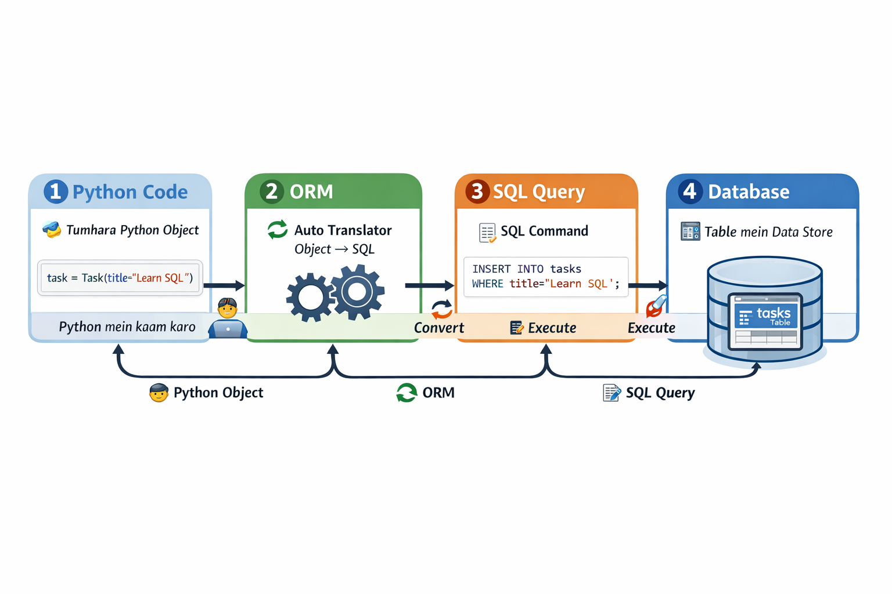

# 1. Understanding Neon:


## 🔹 Tumhara concept (read)

> “Neon khud ik PostgressSql database nahe hia ye postgresssql db ko apne pass cloud pe host karta hai aur har cheez khud manage karta hai toh postgresssql database ko humein khud se manage aur security manage nahe karni parhti server ko manage nahe karna parhta , neon umein full ready postgresssql database provide karta hai bus humein use use karna hota hai , postgress ik database software hai jo data ko store karta hai tables mien , aur neon free tier bhi deta hai aur ye easily fastapi ke sath use ho sakhta hai.”

---

## 🔹 Enhanced & Organized Version (Roman Urdu, Beginner-Friendly)

### 🧠 Neon + PostgreSQL – Simple Explanation

1️⃣ **PostgreSQL kya hai?**

* PostgreSQL ek **database software** hai
* Data ko **tables mein store** karta hai
* Normally server pe install karna padta hai aur khud manage karna padta hai (backup, security, updates)

2️⃣ **Neon kya hai?**

* Neon khud **database software nahi**
* Neon **PostgreSQL ko cloud pe host karta hai**
* Neon ka kaam: server, backup, security, performance sab manage karta hai

3️⃣ **Neon ka faida**

* Hum **khud server manage nahi karte**
* Hum **khud database security nahi dekhte**
* Humein sirf **ready-to-use PostgreSQL database** milta hai
* Free tier available
* FastAPI ke sath easy integration

4️⃣ **Summary**

* PostgreSQL = database software
* Neon = cloud PostgreSQL service, ready & managed
* Tum sirf database ka **use** karte ho, manage nahi

---

💡 **Ek line yaad rakhne ke liye:**

> **“Neon = cloud pe hosted ready PostgreSQL, tum sirf use karo, manage nahi karna.”**

---


<br> </br>


-------------

# 2. Understanding `SQL - ORM - SQLAlchemy - SQLModel`:

## 1️⃣ SQL kya hai?

**Definition:**

> SQL ka full form hai **Structured Query Language**
> Ye ek **language hai jo databases se baat karne ke liye banayi gayi hai**

### Kaam:

* Data **store, read, update, delete** karna
* Tables mein data organize karna
* Queries run karke specific information nikalna

### Example:

```sql
SELECT * FROM tasks;
```

* Matlab: "Tasks table se saara data le do"

### Analogy:

* SQL = database ka **language**
* Tum database se SQL ke zariye bolte ho: “yeh karo, yeh dikhao, yeh delete karo”

---

## 2️⃣ Database kya hai?

**Definition:**

> Database ek **organized collection of data** hai jo computer mein stored hota hai

### Kaam:

* Data ko **safe store** karna
* Fast search aur access provide karna
* Multiple users ke liye data available karna

### Example:

* Task management app → tasks store karne ke liye database

---

## 3️⃣ Database se interact karne ke 2 tareeqe

### 🔹 1) SQL queries ke zariye (direct)

```sql
INSERT INTO tasks (title, status) VALUES ('Learn SQL', 'pending');
```

* Tum directly **SQL commands** use karte ho
* Database samajhta hai aur kaam karta hai

---

### 🔹 2) Programming language ke zariye (Python, JS)

* Python ya JavaScript ke objects use karte ho
* ORM automatically unko **SQL queries mein convert** karta hai
* Tum Python ke **native syntax** mein kaam karte ho

```python
task = Task(title="Learn SQL")
session.add(task)
session.commit()
```

* Isme tum Python object ke sath kaam kar rahe ho
* ORM peeche SQL query run kar deta hai

---

## 4️⃣ ORM kya hai? (Object-Relational Mapping)

**Definition:**

> ORM ek **bridge** hai **programming language objects** aur **database tables** ke beech

### Kaam:

* Tum Python object banao → database table ban jaye
* Tum Python code se CRUD (Create, Read, Update, Delete) karo → SQL queries automatically generate ho jaye
* Tum SQL likhne ki tension nahi lete

### Example:

```python
task = Task(title="Learn ORM")  # Python object
session.add(task)               # Database mein add
session.commit()                # Save in DB
```

* Tum sirf Python object ke sath kaam karte ho
* ORM ne peeche SQL query run kar di

### Analogy:

* Tum remote control se TV chalate ho
* TV ke circuits ya wiring ke baare mein tension nahi leni padti

---

## 5️⃣ SQLAlchemy kya hai?

**Definition:**

> SQLAlchemy ek **Python library** hai jo ORM provide karti hai

### Kaam:

* Python objects ko database tables se map karta hai
* Python se queries run karne ka interface deta hai
* Agar chaho SQL queries manually bhi likh sakte ho

### Example:

```python
from sqlalchemy import Column, Integer, String
from sqlalchemy.ext.declarative import declarative_base

Base = declarative_base()

class Task(Base):
    __tablename__ = "tasks"
    id = Column(Integer, primary_key=True)
    title = Column(String)
```

* Python class → table ban gayi
* Columns → table ke columns

---

## 6️⃣ SQLModel kya hai?

**Definition:**

> SQLModel **SQLAlchemy + Pydantic ka combo** hai
> FastAPI ke liye perfect beginner-friendly ORM

### Kaam:

1. Python class define karo → table automatically create ho jaye
2. Python object → DB record
3. Data validation automatic ho jaye (Pydantic part)

### Example:

```python
from sqlmodel import SQLModel, Field

class Task(SQLModel, table=True):
    id: int = Field(default=None, primary_key=True)
    title: str
```

* `table=True` → table ban jayega database mein
* `primary_key=True` → unique ID
* Python object create → automatic SQL query peeche run

### Analogy:

* SQLAlchemy = powerful remote control
* SQLModel = ready-made remote + safety check (validation included)

---

## 7️⃣ Step-by-step Flow (Python + SQLModel + Database)

1. Tum Python object banao:

```python
task = Task(title="Learn SQLModel")
```

2. Session ke through database ko bolo:

```python
session.add(task)
session.commit()
```

3. ORM peeche SQL query generate karke DB mein data store karega:

```sql
INSERT INTO tasks (title) VALUES ('Learn SQLModel');
```

4. Tum Python object ke sath kaam karte ho
5. Database automatically data manage karta hai

---

## 8️⃣ Panaversity context mein yaad rakhne ke liye

| Term       | Definition                | Kaam                                  |
| ---------- | ------------------------- | ------------------------------------- |
| SQL        | Structured Query Language | Database se baat karna                |
| Database   | Organized data storage    | Data safe store aur fetch karna       |
| ORM        | Object-Relational Mapping | Python object ↔ Database table bridge |
| SQLAlchemy | Python ORM library        | ORM provide karna, queries run karna  |
| SQLModel   | SQLAlchemy + Pydantic     | Simple FastAPI-friendly ORM           |

---

💡 **Ultra-simple one-line summary:**

> Tum Python objects ke sath kaam karte ho, ORM peeche SQL queries generate karta hai, aur database data store karta hai.

---

### here is visual diagrame:


-----------------------

<br> </br>


-------------

# 3. Understanding `SQL-Model --> psycopg2-binary(Postgressql driver) --> Postgressql-Database`:


# ❓ Tumhara Core Question (simple words)

> Jab **SQLModel (ORM)** Python ko **SQL query** mein convert kar raha hai
> to phir wo SQL **direct PostgreSQL database** ko kyun nahi chali jati?
>
> Beech mein **psycopg2-binary** kyun chahiye?

---

# 🔑 Short Answer (one line)

> **SQL likhna aur SQL database tak pohanchana — dono alag kaam hain.**

---

# 🧠 Ab detail mein samjho (real beginner explanation)

---

## 1️⃣ SQLModel / ORM ka kaam sirf yahan tak hai

👉 **SQLModel ka kaam:**

* Python objects lena
* Unko **SQL query** mein convert karna

Example:

```python
task = Task(title="Learn SQL")
session.add(task)
```

ORM peeche ye SQL banata hai:

```sql
INSERT INTO task (title) VALUES ('Learn SQL');
```

🛑 **Yahan ORM ka kaam khatam ho jata hai**

---

## 2️⃣ Ab sawal: SQL query database tak kaise pohanche?

Yahan se **naya kaam start hota hai** 👇

❓ SQL query ko:

* Network ke through bhejna
* Database se connect karna
* Password / URL handle karna
* Response wapas lana

👉 Ye sab kaam **ORM nahi karta**

---

## 3️⃣ Yahan psycopg2-binary ka role aata hai 🔌

### psycopg2-binary kya karta hai?

> psycopg2-binary ek **PostgreSQL driver** hai

### Driver ka kaam:

* PostgreSQL server se **connection banana**
* SQL query ko **wire (internet)** ke through bhejna
* Database ka response wapas lana

---

## 4️⃣ Simple real-life analogy 🧠

Socho:

### Case 1: ORM

* Tum letter likhte ho ✉️ (SQL query)

### Case 2: psycopg2-binary

* Postman jo letter le kar address tak pohanchata hai 🚚

👉 Letter likhna ≠ Letter pohanchana

---

## 5️⃣ Complete flow (Panaversity style)

```
Tumhara Python code
        ↓
SQLModel (ORM)
(Python → SQL)
        ↓
psycopg2-binary (Driver)
(SQL → Database tak)
        ↓
PostgreSQL (Neon)
```

---

## 6️⃣ Direct SQL kyu nahi jati database ko?

❌ Kyun ke:

* Database network pe hota hai
* Authentication (username, password) chahiye
* Database ka **protocol** hota hai (PostgreSQL protocol)

👉 Ye sab **sirf driver samajhta hai**

---

## 7️⃣ Important baat jo beginners miss kar dete hain ⚠️

> ORM **SQL banata hai**
> Driver **SQL chalata hai**

Dono ka role alag hai.

---

## 8️⃣ Agar psycopg2-binary na ho to kya hoga?

❌ SQLModel bolega:

> “Mujhe SQL banana aata hai, lekin database se baat karna nahi”

❌ FastAPI app crash karegi
❌ Database connect hi nahi hoga

---

## 🔚 Final ultra-clear summary (yaad rakhne ke liye)

* SQLModel = translator (Python → SQL)
* psycopg2-binary = delivery boy (SQL → PostgreSQL)
* PostgreSQL = database (Neon)

> **SQLModel likhta hai, psycopg2-binary pohanchata hai**

---

<br>   </br>

-------------

# 4. Understanding `table=True` in SQLModel class:

## 🔹 `class Task(SQLModel, table=True)` — Complete Beginner Explanation

---

## 1️⃣ Sab se pehle: class kya hoti hai? (1 line recap)

> **Class = blueprint / naqsha**
> jis se objects bante hain

```python
task = Task(title="Learn SQL")
```

---

## 2️⃣ `SQLModel` ko inherit karna kyun zaroori hai?

```python
class Task(SQLModel):
```

### Matlab:

* Task class ko **SQLModel ki powers mil jati hain**
* Jaise:

  * database se connect hone ka logic
  * ORM wali properties
  * SQL generate karne ki ability

🧠 Socho:

> SQLModel = super class
> Task = child class
> Task ne SQLModel se powers le li

---

## 3️⃣ Ab main confusion: `table=True` kya hai? ❓

### Simple definition:

> `table=True` ka matlab hai:
> **"Is class se database ki table bhi banao"**

---

## 4️⃣ Agar `table=True` na likho to kya hoga?

```python
class Task(SQLModel):
    title: str
```

👉 Is case mein:

* Ye class **sirf Python data model** hogi
* Ye database mein **table nahi banayegi**
* Sirf data validate karne ke kaam aayegi

🧠 Matlab:

> Ye sirf structure hai, storage nahi

---

## 5️⃣ Jab `table=True` likhte ho to kya hota hai?

```python
class Task(SQLModel, table=True):
    id: int = Field(default=None, primary_key=True)
    title: str
```

👉 Ab ye hota hai:

1. Database mein **`task` naam ki table ban jati hai**
2. Class ke variables → table ke columns
3. SQLModel is class ko ORM table samajh leta hai

🧠 Socho:

> `table=True` = “Is class ko database mein utar do”

---

## 6️⃣ Real-life analogy 🧠

Socho tum design bana rahe ho:

| Cheez        | Matlab                       |
| ------------ | ---------------------------- |
| Class        | Ghar ka naqsha               |
| SQLModel     | Engineer                     |
| `table=True` | “Is naqshay se ghar bana do” |

Agar `table=True` ❌:

> Sirf design hai, ghar nahi bana

Agar `table=True` ✅:

> Ghar bhi ban gaya

---

## 7️⃣ Kyun `table=True` likhna zaroori hai?

Kyunkay SQLModel 2 tarah ki classes support karta hai:

### 🔹 1) Data-only model (validation ke liye)

```python
class TaskCreate(SQLModel):
    title: str
```

* Sirf FastAPI request validate karegi
* Database table nahi banegi

---

### 🔹 2) Database table model

```python
class Task(SQLModel, table=True):
    id: int | None = Field(default=None, primary_key=True)
    title: str
```

* Database table banegi
* CRUD operations possible

---

## 8️⃣ `table=True` ke baghair database kaam kyun nahi karega?

❌ SQLModel ko pata hi nahi chalega:

> “Is class ka table banana hai ya nahi?”

👉 Is liye explicit likhna parta hai.

---

## 9️⃣ Panaversity + FastAPI context (important)

Panaversity ke course mein:

* SQLModel use hota hai
* Clean architecture follow hoti hai

Is liye:

* Data validation ke liye alag class
* Database table ke liye alag class

👉 `table=True` ye difference clear karta hai.

---

## 🔚 Final ultra-simple summary (yaad rakhne ke liye)

* `SQLModel` inherit karna = ORM ki powers lena
* `table=True` = database ko kehna “table bana do”
* `table=True` ke baghair = sirf Python class
* `table=True` ke sath = Python class + DB table

### 🧠 One line:

> **SQLModel power deta hai, `table=True` us power ko database tak le jata hai**

---

--------------

<br>  </br>

-----------------

# 5. `Primary_key` in SQLModel:


## 1️⃣ Sab se pehle: primary key hoti kya hai?

**Definition (simple):**

> **Primary key** wo column hota hai
> jo table ke **har record ko uniquely pehchanta** hai

### Matlab:

* Har row ka **alag number**
* Duplicate allowed ❌
* Khali (NULL) allowed ❌

---

## 2️⃣ Real-life example 🧠

Socho:

| Cheez  | Primary Key    |
| ------ | -------------- |
| CNIC   | CNIC number    |
| School | Roll number    |
| Bank   | Account number |

👉 Do logon ka CNIC same nahi hota
👉 Is liye system unko confuse nahi karta

---

## 3️⃣ Database table example

### Without primary key ❌

| id | name |
| -- | ---- |
| ?  | Ali  |
| ?  | Ali  |

❌ Database confuse ho jata hai
❌ Update / delete mushkil

---

### With primary key ✅

| id (PK) | name |
| ------- | ---- |
| 1       | Ali  |
| 2       | Ali  |

✅ Clear
✅ Fast
✅ Safe

---

## 4️⃣ Ab `primary_key=True` ka matlab

```python
id: int | None = Field(default=None, primary_key=True)
```

### Is line ka matlab:

> “Database!
> is `id` column ko **primary key** bana do”

---

## 5️⃣ Database iske baad kya karta hai?

Jab tum new record add karte ho:

```python
Task(title="Learn SQL")
```

Tum `id` nahi dete.

Database khud karta hai:

| id | title         |
| -- | ------------- |
| 1  | Learn SQL     |
| 2  | Learn ORM     |
| 3  | Learn FastAPI |

👉 Ye **auto-increment** hota hai
👉 Ye primary key ki power hai

---

## 6️⃣ Agar `primary_key=True` na ho to kya hota?

❌ Database ko pata hi nahi hota:

* Kaun sa column unique hai
* Kaun sa record update / delete karna hai

Example:

```sql
DELETE FROM task WHERE title='Learn SQL';
```

❌ Do rows delete ho sakti hain

---

## 7️⃣ Beginner ke liye ek bohot important baat ⚠️

> **Primary key user kabhi manually nahi deta**
> Ye hamesha **system / database** deta hai

Is liye:

```python
default=None
```

likhte hain.

---

## 8️⃣ One-sentence mein samjho 🧠

> **`primary_key=True` database ko bolta hai:
> “Is column ko table ka unique ID bana do.”**

---

## 9️⃣ Ultra-simple analogy (yaad rakhne ke liye)

Socho ek token system:

* Customer aaya → token nahi
* System ne token diya → 1
* Next customer → 2
* Same token kabhi repeat nahi hota

👉 Token = primary key

---

## 🔚 Final summary (sirf 3 points)

* Primary key = unique pehchan
* Duplicate allowed nahi
* Database khud value generate karta hai

### 🧠 One-line:

> **primary_key=True = system-generated unique ID**

---


<br>  </br>


--------------

# 6. Confusion b/w **psycopg2** and **create_engine**:

## ❓ Confusion Summary

> **psycopg2 bhi database se baat karwata hai**
> to phir **create_engine bhi connection banata hai**
>
> **dono ek hi kaam kar rahe hain kya?**

👉 **Nahi. Dono ka kaam alag level pe hai.**

---

# 🧠 Short Answer (1 line)

> **psycopg2 engine ka engine hai**
> **create_engine us engine ko control karta hai**

---

# 🧩 Ab layer-by-layer samjho (MOST IMPORTANT)

---

## 🥉 Layer 1 — psycopg2-binary (Lowest level)

### Kya karta hai?

* PostgreSQL ke **actual protocol** ko samajhta hai
* Network pe database se baat karta hai
* Raw SQL bhejta aur result leta hai

### Matlab:

> Ye **direct driver** hai
> Python ↔ PostgreSQL

### Tum kab use karte ho?

❌ Normally nahi
ORM ke peeche chupa hota hai

---

## 🥈 Layer 2 — SQLAlchemy Engine (`create_engine`)

### Kya karta hai?

* psycopg2 ko **use karta hai**
* Connection **pool** banata hai
* Decide karta hai:

  * kab connection lena
  * kab chorna
  * kitne connections allowed hain

### Matlab:

> Ye **manager** hai
> jo psycopg2 ko control karta hai

---

## 🥇 Layer 3 — Session (ORM level)

### Kya karta hai?

* Engine se connection mangta hai
* ORM objects ko SQL mein convert kar ke chalaata hai
* Transaction handle karta hai

---

# 🧠 Real-life analogy (best way)

Socho **delivery system**:

| Cheez         | Role                          |
| ------------- | ----------------------------- |
| psycopg2      | Driver (bike chalata hai) 🏍️ |
| create_engine | Dispatch office 🚚            |
| Session       | Delivery boy                  |

* Driver ke baghair bike nahi chalegi
* Dispatch ke baghair chaos
* Delivery boy ke baghair kaam nahi hoga

---

# 🔄 Complete flow (yaad rakhne ke liye)

```
SQLModel
   ↓
Session
   ↓
Engine (create_engine)
   ↓
psycopg2-binary
   ↓
PostgreSQL (Neon)
```

---

# ❓ To phir hum psycopg2 ko direct kyun nahi use karte?

Kar sakte ho ❗
lekin phir:

* Connection khud manage karo
* Transactions khud handle karo
* SQL khud likho
* Errors khud handle karo

👉 ORM + engine sab asaan bana dete hain

---

# 🧠 One-line clarity sentence

> **psycopg2 baat karwata hai, create_engine system banata hai jo decide karta hai kaun, kab, aur kaise baat karega**

---

# 🔚 Final summary (no confusion version)

* psycopg2 = actual connector (low-level)
* create_engine = connection manager
* Session = ORM ka worker
* SQLModel = Python → SQL translator

---


<br>  </br>


# 7. understanding `SQLModel.metadata.create_all(engine)`:

### Final Enhanced Concept (Complete, Tumhari Wording Mein)

`SQLModel.metadata.create_all(engine)` ka matlab ye hai:

1. Tumhari `Task` class mein **SQLModel ki power hai** aur `table=True` likhne ki wajah se ye class **database table ban sakti hai**.

2. **SQLModel is class ko lega**, uske **fields aur types ko SQL query mein convert karega**, aur ye information **metadata** mein store karega.

   * Metadata ek **blueprint / record** hai jo batata hai ki **kaun si tables aur columns create karne hain**.

3. `create_all()` is metadata ko use karke, **table create kar deta hai** us database mein jo **engine ke through connected hai**.

4. Engine ka kaam hai **specific database tak connection provide karna**, jahan ye table create hogi.

---

#### Example Class:

```python
class Task(SQLModel, table=True):
    id: int | None = Field(default=None, primary_key=True)  # primary key defines unique identity for each record/row in the table
    title: str
    description: str | None = Field(default=None)
```

* `id` → har record ki **unique identity**, database khud generate kar sakta hai agar value None ho
* `title` → text field, required
* `description` → optional text field, default None

---

### One-line Simplified Flow

> **“Class ka data → SQLModel fields ko SQL query mein convert → Metadata → create_all → Engine ke database mein table”**

---

<br> </br>


# 8. understanding `Sesssion - psycopg2 - create_engine & with block`:

### Improved Concept (Tumhari Words Mein)

* **psycopg2-binary** actually database se **direct connect aur communicate** karta hai.

* **create_engine** ek **engine object** banata hai jo **connections ko manage** karta hai.

  * matlab psycopg2 engine ke through database se baat karta hai, direct nahi.

* **Session** ek **temporary workspace / session** create karta hai:

  * Python objects ko SQL queries mein convert karta hai (ye ORM ka kaam hai)
  * Engine ke through psycopg2 ko use karke **SQL query database tak le jata hai**
  * Session khatam hone ke baad ye workspace close ho jata hai

* Session ka behavior **`with` block** ke saath:

  * Jaise hum file ko `.open()` aur `.close()` karte hain,
  * `with Session(engine)` automatically **connection open aur close** karta hai

* **SQLModel** ORM ka kaam karta hai:

  * Python classes aur objects ko **SQL queries mein convert** karta hai
  * Engine aur session ke through database se communicate karta hai

* Simple analogy:

  * Psycopg2 = driver
  * Engine = dispatch manager
  * Session = temporary chat / conversation workspace
  * SQLModel = translator (Python → SQL)

* **Overall flow:**

```text
Python object → SQLModel ORM → Session → Engine → psycopg2 → Database
```

---

💡 **Key takeaways (beginners ke liye):**

1. Psycopg2 = low-level connector (actual baat karta hai database se)
2. Engine = connection manager
3. Session = temporary workspace for Python objects → SQL
4. `with` block = automatically open/close connection
5. SQLModel = ORM, Python → SQL translator

---


<br> </br>